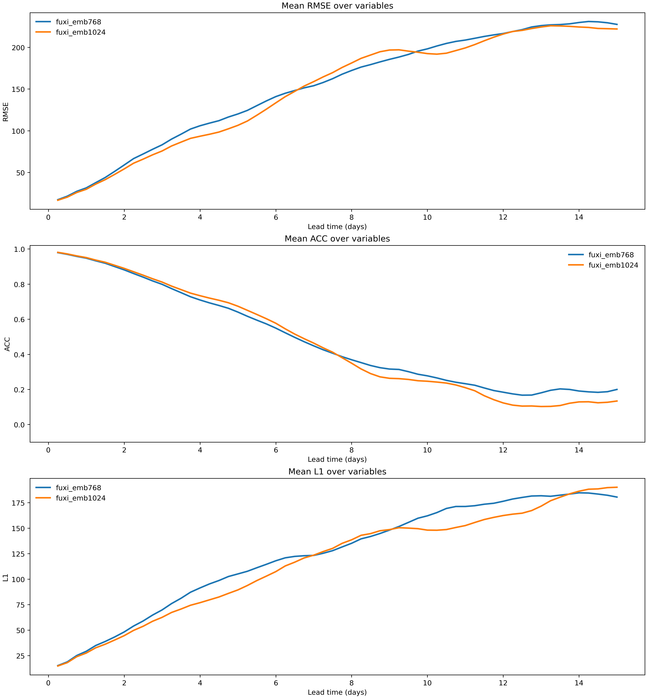
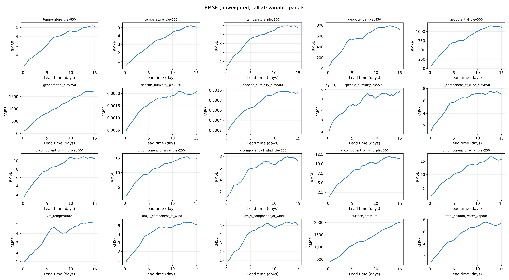
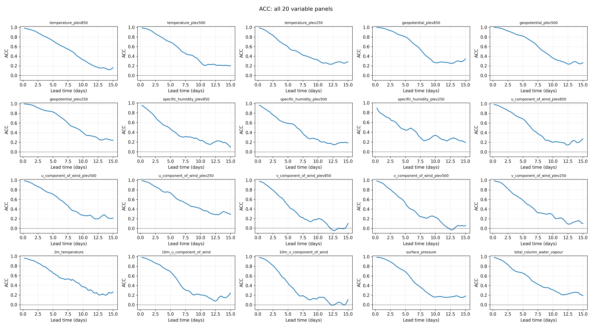

# Shared benchmark (forecast-only)

This folder gives you one consistent path to compute RMSE and ACC from forecast files.

You can use forecasts from any weather model. The model itself is not run here.
You only provide forecast NetCDF files, then this benchmark computes metrics and comparison outputs.

## What you can do with this

- compute latitude-weighted RMSE
- compute unweighted RMSE
- compute ACC (anomaly correlation)
- optionally compute L1
- compare multiple models with the same evaluation settings

## Required forecast file format

Each forecast NetCDF must include:

- data variable `forecast`
- data variable `truth`
- coordinate `channel_name`
- coordinate `lead_step`
- coordinate `lat`
- coordinate `lon`

Required dimension order for both `forecast` and `truth`:

- `init_time`
- `lead_step`
- `channel`
- `lat`
- `lon`

Expected shape:

- `(n_init, n_lead, n_channel, n_lat, n_lon)`

## Metric formulas used in this benchmark

Metrics are computed for each channel $c$ and lead time $\tau$, then averaged over all initialization times in set $D$.

Notation:

- $\hat{X}$: model forecast
- $X$: target truth
- $M$: climatology at valid time
- $i,j$: latitude and longitude indices
- $H,W$: number of latitude and longitude points
- $\phi_i$: latitude at index $i$

Latitude weight:

$$
a_i = \frac{\cos(\phi_i)}{\mathrm{mean}_i[\cos(\phi_i)]}
$$

Weighted RMSE:

$$
\mathrm{RMSE}(c,\tau)=\frac{1}{|D|}\sum_{t_0\in D}
\sqrt{\frac{1}{HW}\sum_{i,j}a_i\left(\hat{X}_{c,\tau,t_0}(i,j)-X_{c,\tau,t_0}(i,j)\right)^2}
$$

Unweighted RMSE (also exported):

$$
\mathrm{RMSE}_{\mathrm{unweighted}}(c,\tau)=\frac{1}{|D|}\sum_{t_0\in D}
\sqrt{\frac{1}{HW}\sum_{i,j}\left(\hat{X}_{c,\tau,t_0}(i,j)-X_{c,\tau,t_0}(i,j)\right)^2}
$$

ACC (anomaly correlation):

$$
\mathrm{ACC}(c,\tau)=\frac{1}{|D|}\sum_{t_0\in D}
\frac{\sum_{i,j}a_i\,(\hat{X}-M)(X-M)}
{\sqrt{\left(\sum_{i,j}a_i\,(\hat{X}-M)^2\right)\left(\sum_{i,j}a_i\,(X-M)^2\right)}}
$$

Climatology $M$ is selected by valid time (day-of-year and hour).

Optional L1 (if enabled):

$$
\mathrm{L1}(\tau)=\mathrm{mean}_{\mathrm{init,channel,lat,lon}}\left|\hat{X}-X\right|
$$

## How ranking works

The benchmark writes `comparison/model_summary.csv` and sorts by:

1. lower `mean_rmse` first
2. if RMSE is tied, higher `mean_acc`

You also get horizon-wise comparison in `comparison/horizon_comparison.csv` using your configured `horizon_days`.

## Example plots

These are real outputs from this repo:

### Comparison figure



### RMSE per-variable panels (all 20 variables)



### ACC per-variable panels (all 20 variables)




## Expected results after one run

Inside `results_root/checkpoint_<model_name>/metrics/`:

- `summary.json`
- `metrics_per_lead.csv`
- `mean_metrics_per_lead.csv`
- `horizon_window_summary.csv`
- `poster_all20_rmse_per_variable.png`
- `poster_all20_acc_per_variable.png`
- optional `l1_per_lead.csv` (when L1 is enabled)

Inside `results_root/comparison/`:

- `model_comparison.png`
- `model_summary.csv`
- `horizon_comparison.csv`

Inside `docs/shared_benchmark_examples/`:

- `model_comparison.png`
- `poster_all20_rmse_per_variable_emb768.png`
- `poster_all20_acc_per_variable_emb768.png`

## Step-by-step usage

1. Export forecast files from your model in the required schema.
2. Copy and edit [src/shared_benchmark/example_config.json](src/shared_benchmark/example_config.json).
3. Add one model entry per forecast file with:
   - `name`
   - `forecast_file`
4. Run:

```bash
python -m src.shared_benchmark.run_benchmark --config src/shared_benchmark/example_config.json
```

Optional CLI switches:

```bash
python -m src.shared_benchmark.run_benchmark \
  --config src/shared_benchmark/example_config.json \
  --compute-l1
```

Use `--no-compute-l1` to force-disable L1.

## Config keys

- `results_root`: output folder
- `horizon_days`: example `[5, 10, 15]`
- `compute_l1`: true/false
- `strict_consistency`: true/false
- `eval_no_heatmaps`: true/false
- `overwrite_eval`: true/false
- `climatology_store`: optional override path
- `models`: list of model entries

Each model entry:

- `name`: label shown in plots and tables
- `forecast_file`: path to forecast NetCDF

## Common errors

`Forecast file not found`

- check file path in config
- relative paths resolve from repo root

`Consistency check failed`

- channel order, lead steps, or grid shape do not match across models
- fix forecast exports or set `strict_consistency: false` intentionally

`Missing variable/coordinate`

- required fields are missing in the NetCDF

`Dimension order error`

- both `forecast` and `truth` must be `(init_time, lead_step, channel, lat, lon)`

## Quick export checklist

Before evaluation, make sure your file has:

1. `forecast`
2. `truth`
3. `channel_name`
4. `lead_step`
5. `lat`, `lon`
6. correct 5D dimension order
